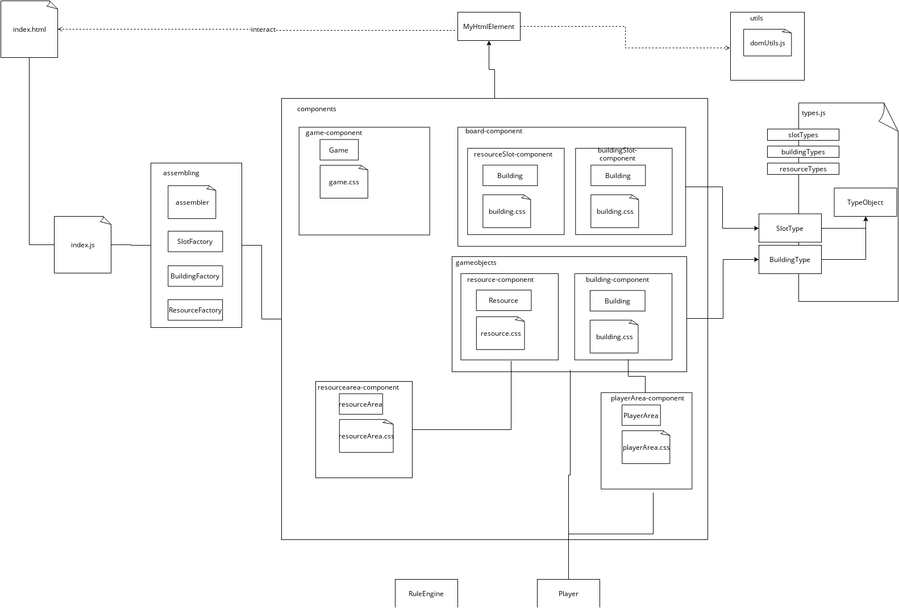

# Content
- [Content](#content)
- [Introduction](#introduction)
- [Demo](#demo)
- [Development](#development)
  - [Getting Started](#getting-started)
  - [Project Toolset](#project-toolset)
  - [Software Architecture](#software-architecture)
# Introduction
This project was initiated to learn more about Javascript, CSS and HTML while practicing web development. 
The pursued goals are as followed:
1. Create a fronted web application
2. Utilize CSS and HTML as much as possible
3. Utilize Vanilla JS (ES6) as much as possible
4. Utilize CI/CD practices
5. Continously reflect implementation on software development principals (KISS, DRY, SOLID) and refactor accordingly

# Demo
The most recent version can be found at https://dplantera.github.io/jsboardgamedemo/

# Development
## Getting Started
1. Setup development environment ([Project Toolset](#project-toolset)).
2. Install project and start developing:
      ```nodejs
    $ npm install
    $ npm run start
    ```
3. Push changes to a new branch.
4. Review result: https://dplantera.github.io/jsboardgamedemo/

## Project Toolset
|Tool|Context|Purpose|
|:-|:-|:-|
|VS Code|IDE/Editor|programming|
|JavaScript (ES6) code snippets|vs code|programming|
|JS-CSS-HTML Formatter|vs code|programming|
|Parcel|nodeJS|live server and packaging for local development and deployment|
|Github Actions|vs code|defining templates for continuous delivery|
|Draw.io Integegration|vs code|editing diagrams for documentation|
|Markdown All in One|vs code|editing diagrams for documentation|

## Software Architecture

